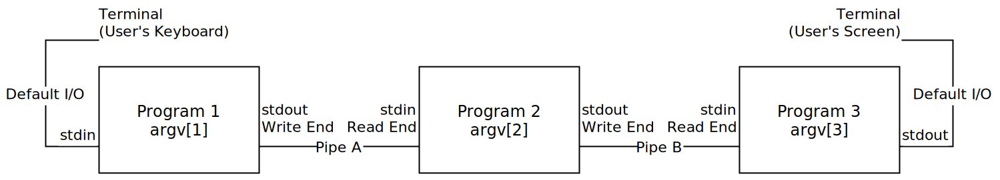

V Wheatley  
Systems Programming

# `pipex`

This was a pretty easy extrapolation from the `pipe.c` example program. I *did* go through and comment all of the example program, though. It's included in the Git repository [hosted on GitHub as per usual](https://github.com/vwheatle/SystemsProgramming-pipex).

Also, I made an accompanying diagram!



I broke the program's flow into four parts:

- `pipeline_create`: Creating all the pipes needed for the pipeline.
- `become_n_processes`: Forking enough processes to run the programs in the pipeline.
- `pipeline_set_io`: Redirecting `stdin`/`stdout` to the correct ends of the pipes. (In some cases, not redirecting at all!)
- `pipeline_run`: Running the specified programs.

...and in most of these functions, I pass around a `pipeline_info` struct. This struct contains the number of needed processes, pipes, and it stores their associated program names (as strings stolen from `argv`) and pipe ends (as file descriptors).

## Example Execution

`xclip`, when executed without arguments, will read anything from `stdin` into the clipboard. `xclip -o` will then read the contents of the clipboard back out.

```text
$ ./pipex cat tac xclip
hello, world
this is the second line!
and the third!
i wonder if this is going to appear on a clipboard one day.
$ xclip -o
i wonder if this is going to appear on a clipboard one day.
and the third!
this is the second line!
hello, world
```

And for good measure, the example from the instructions PDF:

```text
$ ./pipex who sort wc
      3      16     143
```

It's questionable if this a pipeline like this will ever be used in the real world, though:

```text
$ ./pipex cat tac tac tac tac tac
one
two
three
four
five<Ctrl+D pressed>
five
four
three
two
one
```
